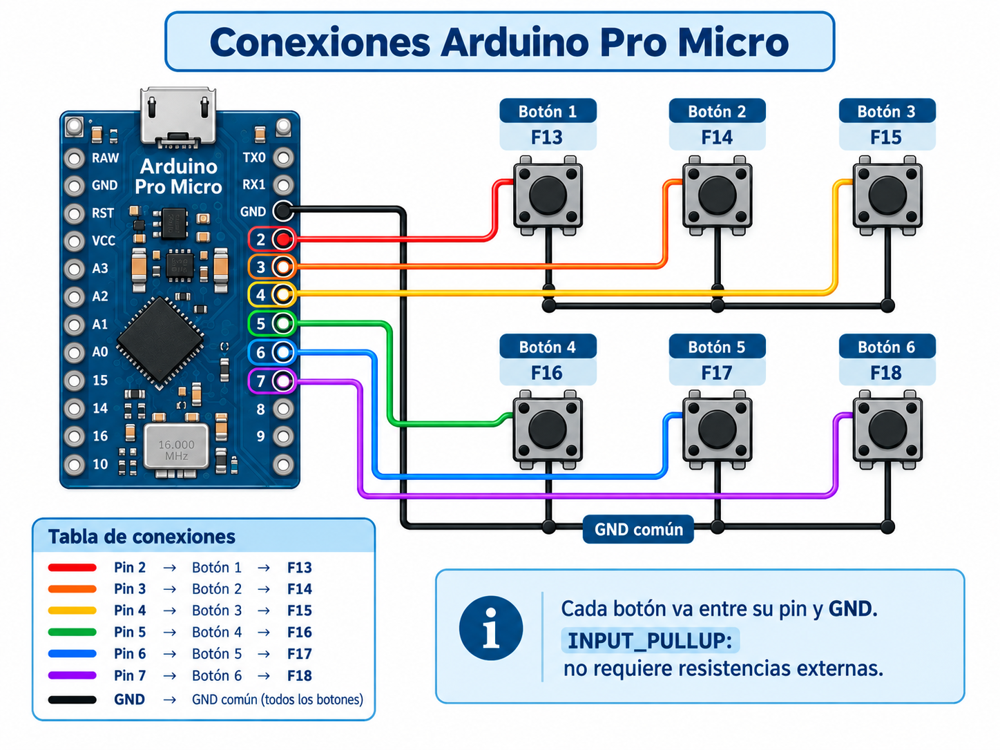

# SATURN Control

> **English (GitHub About):** DIY 6-key macro pad (Arduino Pro Micro HID → F13–F18) with a local Python/Flask control panel. Per-profile macros for Windows + Linux. Validated on Arch Linux XFCE/X11 with playerctl + wpctl/pactl.

**SATURN Control** es un macro pad casero de **FD Labs**: un aparatito de 6 botones físicos que vive en tu escritorio y dispara macros en tu PC. Lo construís con un Arduino Pro Micro, lo conectás por USB y la app local escucha las teclas para ejecutar acciones configurables por perfil: multimedia, volumen, apps, OBS, atajos y comandos propios.

Está pensado como proyecto personal mostrable: hardware accesible, software propio y documentación honesta de cómo funciona por dentro.

## Qué es SATURN Control

- Un **dispositivo HID USB**: el Pro Micro se hace pasar por un teclado y envía teclas `F13` a `F18` cuando apretás los botones.
- Una **app local Python/Flask** con panel web en `http://127.0.0.1:5000`: escucha esas teclas y ejecuta la macro del perfil activo.
- Un sistema de **perfiles**: Media, Stream, Trabajo, FD Labs (y los que crees vos), cada uno con sus 6 botones, etiquetas y parámetros.
- Funciona en **Windows y Linux**. En Linux está validado en Arch Linux XFCE/X11 con `playerctl` para multimedia y `wpctl`/`pactl` para volumen.

## Características principales

- 6 botones físicos → `F13`–`F18`, con debounce y pulsos cortos desde el firmware.
- Panel web local: deck visual, editor por botón, diagnóstico en vivo y gestión de perfiles con autoguardado.
- Catálogo de acciones: multimedia, audio, apps (navegador, OBS, VS Code/Codium, Discord, Spotify, Steam, Telegram, Obsidian, terminal), sistema, web, atajos custom, texto, comandos shell y por OS, acciones Dev de VS Code y OBS por WebSocket.
- Diagnóstico F13–F18: muestra última tecla, código raw, botón mapeado, backend del listener, sesión y dependencias. Normaliza evdev, keysyms X11/XFCE y códigos HID.
- Perfiles con autoguardado y selector de acciones con buscador.
- Firmware abierto en `firmware/` y keycaps imprimibles en `keycaps/`.

## Hardware usado

| Componente | Qué hace |
| --- | --- |
| Arduino Pro Micro (ATmega32U4) o Leonardo compatible | Cerebro USB: se presenta como teclado HID |
| 6 pulsadores | Entradas del deck |
| Cables + protoboard / soldadura | Conexión botones → pines + GND |
| PC con Windows o Linux | Corre la app y el panel web |

Detalle de diseño: [`docs/HARDWARE.md`](docs/HARDWARE.md).

## El Pro Micro como HID

El Pro Micro usa el micro ATmega32U4 con USB nativo y la librería `Keyboard.h`. No es un puerto serie: el sistema lo ve como **teclado USB** (en Linux aparece como `Arduino Leonardo`).

Por eso elegimos `F13`–`F18`: casi ningún programa las usa, así no chocan con tus atajos normales. El firmware solo manda un **tap corto** (14 ms) por pulsación, con debounce de 25 ms y loop no bloqueante. El LED integrado parpadea con cada toque para confirmar actividad.

## Cableado de botones

Cada botón va entre **un pin digital y GND**. Sin resistencias externas: el firmware usa `INPUT_PULLUP`.

- Pin en reposo: en HIGH (gracias al pull-up interno).
- Botón apretado: pin a GND → LOW → el firmware dispara el tap.
- **GND común**: todos los pulsadores comparten el mismo GND. Una pata de cada botón va a su pin, la otra pata va al GND común del Pro Micro. Simple y fácil de soldar en cadena.

Guía paso a paso: [`docs/WIRING.md`](docs/WIRING.md).

### Tabla botón / pin / tecla

| Botón | Pin Pro Micro | Tecla enviada |
| ---: | --- | --- |
| 1 | 2 | F13 |
| 2 | 3 | F14 |
| 3 | 4 | F15 |
| 4 | 5 | F16 |
| 5 | 6 | F17 |
| 6 | 7 | F18 |

Si usás otros pines, solo cambiás la tabla `BUTTONS` en `firmware/saturn_pro_micro/saturn_pro_micro.ino`. El detalle del sketch (tap, debounce, repetición opcional, debug serial) está en [`firmware/README.md`](firmware/README.md).

## Cómo funciona: firmware + app

```text
Dedo → botón → pin a GND → firmware manda tap F13-F18
  → SO lo ve como teclado HID
  → app Python escucha la tecla (pynput/keyboard)
  → busca el botón en el perfil activo
  → ejecuta la macro (playerctl, wpctl, app, URL, OBS...)
  → panel web muestra el evento en vivo
```

- Firmware: lee 6 pines con `INPUT_PULLUP`, filtra rebotes, envía taps.
- App (`app.py`): listener con debounce configurable, mapa tecla→botón, ejecutor de acciones por SO y API (`/api/config`, `/api/actions`, `/api/diagnostics`, `/api/events`, `/api/test/<id>`).
- Web (`web/`): deck, editor, perfiles, diagnóstico y ayuda.

## Windows

Probar en desarrollo:

```bat
launch_desktop.bat
```

Generar `.exe` (PyInstaller) + instalador (Inno Setup):

```bat
build_release_winteros.bat
```

Entregable: `release\SATURN-Control-Setup-1.1.1.exe`. La config del usuario vive en `%APPDATA%\SATURN Control\config.json`, así reinstalar no borra tus macros. Detalle: [`README_WINDOWS_EXE.md`](README_WINDOWS_EXE.md) y [`README_DISTRIBUCION.md`](README_DISTRIBUCION.md).

## Linux (validado: Arch + XFCE + X11)

```bash
sudo pacman -S --needed python python-pip tk playerctl wireplumber xdotool xdg-utils evtest usbutils
chmod +x *.sh
./diagnose_linux.sh
./launch_linux.sh
```

Panel: `http://127.0.0.1:5000`. Detalle: [`README_LINUX.md`](README_LINUX.md).

Test de hardware:

```bash
sudo evtest
# elegí Arduino Leonardo → debe mostrar KEY_F13...KEY_F18
# o
.venv/bin/python tools/key_watch_pynput.py
```

Notas reales de campo: en X11/XFCE `pynput` a veces entrega F13–F18 como keysyms raros — la app ya los normaliza. Multimedia va por `playerctl`, volumen por `wpctl` con fallback a `pactl`, hotkeys/texto por `xdotool`. En Wayland el listener global puede estar limitado (se avisa en Diagnóstico).

Acceso en menú:

```bash
./install_desktop_linux.sh
```

## Keycaps impresas en 3D

El deck se siente completo con keycaps propias. Idea base para el perfil Media:

```text
PLAY   PREV   NEXT
MUTE   VOL-   VOL+
```

Y opción neutra que sirve para cualquier perfil:

```text
S1 S2 S3
S4 S5 S6
```

Recomendación de impresión y siguientes iteraciones: [`docs/KEYCAPS.md`](docs/KEYCAPS.md) (origen: [`keycaps/README_KEYCAPS.md`](keycaps/README_KEYCAPS.md)).

## Estado del proyecto

**v1.1.1 estable y multiplataforma.** Fusiona la v1 Windows con la edición Linux profesional: mismo `app.py`, misma web, ambos SO. Hardware funcional, firmware estable, instalador Windows, scripts Linux, diagnóstico vivo.

SATURN es parte del ecosistema FD Labs: [`docs/FD_LABS.md`](docs/FD_LABS.md). Autoría y proceso (incluye uso honesto de IA como apoyo): [`AUTHORSHIP.md`](AUTHORSHIP.md).

## Próximos pasos

- **SATURN v2**: 4 botones + 2 potenciómetros + pantalla OLED.
- Potenciómetros para volumen/scroll con HID extra.
- OLED para mostrar perfil activo y última acción.
- Integración con **ATLAS** (asistente local de FD Labs).
- Ideas en [`ROADMAP.md`](ROADMAP.md): exportar/importar perfiles, calibración guiada, builds Linux empaquetados, carcasa impresa 3D.

---

Hecho con cariño en FD Labs: hardware barato, software propio y macros que sí usás todos los días.

## Diagrama de conexiones

Cada botón va entre su pin y GND.  
El firmware usa `INPUT_PULLUP`, por eso no se necesitan resistencias externas.


